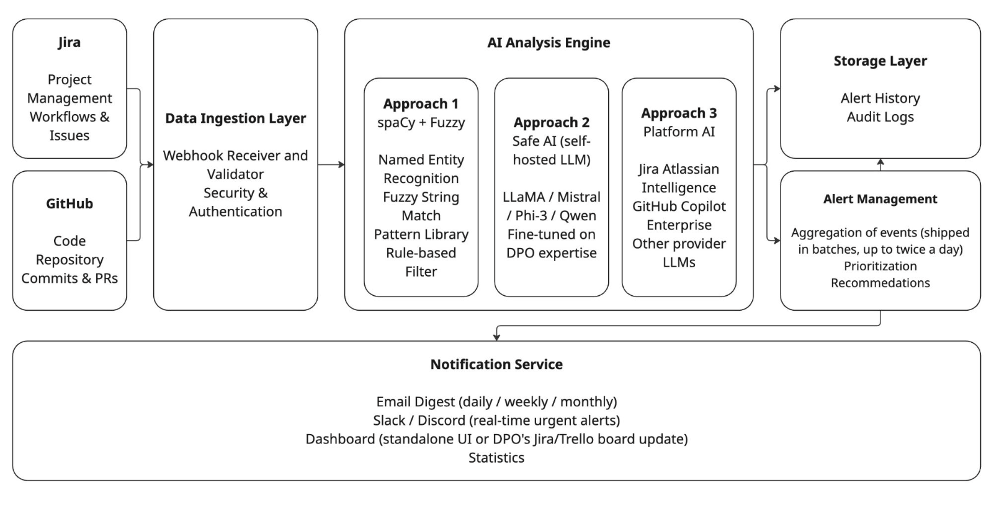

# Compliance Ticket Classifier — Deep Learning Capstone

**Author:** Kateryna Dubas
**Task:** Text classification (binary)
**Model:** Fine-tuned DistilBERT
**Repository:** https://github.com/octapricot/compliance-ticket-classifier

---

## 1. Overview

This project builds and evaluates a deep learning classifier that flags software-development tickets (Jira issues and GitHub issues) as **compliance-relevant**, that is, tickets a Data Protection Officer (DPO) should review (or at least know about) because they touch personal data or data-protection obligations.

The final model, a fine-tuned DistilBERT, reaches **F1 0.59 / precision 0.83 / recall 0.46** on a held-out test set of real, human-labeled tickets (a clear improvement over a TF-IDF + logistic-regression baseline (F1 0.43)). More importantly, the project aims to demonstrate a complete, honest development cycle on a daily, but vexing problem: a domain where **no labeled data existed** and where the positive class is rare.

This classifier is an attempt at implemented, evaluated core of a larger concept, an **AI-powered DPO Helpdesk** that monitors development workflows for compliance triggers. This capstone builds and rigorously tests the machine-learning component at the heart of that system's alerting.



---

## 2. Problem and motivation

Modern software teams routinely create tickets that carry data-protection consequences without using any privacy vocabulary. A ticket that says *"add a microservice for application log storage"* creates a system that may store personal data and is therefore subject to data-protection-by-design requirements — yet it contains no words like "personal data" or "GDPR." A DPO monitoring a busy issue tracker cannot read every ticket, and simple keyword search
misses exactly these subtle, high-value cases.

This produces a concrete gap:

- **Manual review does not scale.** A DPO serving several client organizations cannot read every ticket and code commit.
- **Keyword search is blind to context.** The same word means different things: *"profiling"* usually means performance profiling, not GDPR profiling; *"tracking"* usually means bug tracking. Keywords produce both false negatives (subtle triggers) and false positives (irrelevant matches).

The goal of this project is a classifier that captures the **semantic** signal a keyword filter cannot: one that learns what "a DPO should look at this" actually looks like.

---

## 3. Task definition

The task is **binary classification**: is a ticket compliance-relevant (`relevant`) or not (`not_relevant`)?

A deliberate part of the design was defining *relevance* precisely, because the definition determines label quality. A ticket is **relevant** if **either** of two conditions holds:
- **Trigger-by-design**: the development task itself creates, stores, deletes, processes, or makes automated decisions about personal data (e.g. user-data export, deletion endpoints, analytics on users, storing user information in logs, third-party data integrations).
- **Incidental exposure**: the ticket *text itself* contains real personal or sensitive data (a real user's email or name in a stack trace, a real user record in a bug reproduction). This matters operationally: names and identifiers pasted into tickets create a downstream erasure-request burden and a data-minimization concern.

Everything else (pure logic bugs, performance work, tests, build/config, refactoring) is **not relevant**.

This two-pronged definition is itself a finding: during data exploration it became clear that "compliance relevance" is not one signal but two distinct ones, and that treating them together (rather than as separate labels) keeps the model focused on the practical question a DPO Helpdesk actually asks: *"Is there anything here worth a human's attention?"*

---

## 4. Data — the hardest and most interesting part

### 4.1 The core challenge: no labels, rare positives

The raw material is a large public dataset of Jira and GitHub issues (`hankzhwang/issues` on Hugging Face). It contains ticket text but **no compliance labels**, creating those labels was the project itself. Two properties made this hard:

1. **The data is compliance-poor.** The available repositories are deep infrastructure projects (MongoDB, CockroachDB, etcd, ZooKeeper, Windows Subsystem for Linux). These are built by engineers for engineers; genuine data-protection tickets are rare (roughly 3–6% of pre-filtered candidates).
2. **Labeling requires domain expertise.** Deciding whether a terse, technical ticket triggers a compliance obligation is exactly the judgment a DPO makes. This is a strength of the project (as the labels carry real domain expertise) but it also means labels cannot be crowdsourced cheaply.

### 4.2 The pipeline

The data pipeline was built as a sequence of reproducible stages, each producing a versioned artifact:

```
raw issues  >>  candidate pre-filter  >>  AI-drafted labels  >>  human review  >>  gold labels  >>  train / test split
```

- **Pre-filtering (a lightweight rule-based screen).** To avoid hand-labeling thousands of irrelevant tickets, a screening step surfaces *candidates* using exact keyword matching, fuzzy phrase matching, and regex for incidental exposure (emails, non-private IPs, internal hostnames). This is a simplified implementation of a classic NLP compliance pipeline. During development, several "false-friend" keywords (`authentication`, `password`, `tracking`, `profiling`) were found empirically to be low-signal in engineering tickets and were pruned (a documented, evidence-based decision).

- **AI-assisted labeling with human review.** Candidate tickets were first labeled by a large language model acting as a DPO (drafting a label, confidence, and a one-line reason), then **reviewed and corrected by a human DPO** in Label Studio. This hybrid approach removed the tedium of labeling from scratch while keeping expert judgment as the final authority. Human review meaningfully changed the labels (it roughly tripled the number of positives the model alone identified), primarily by catching incidental-exposure cases (real names in ticket bodies) that the automated draft missed.

- **Two labeling rounds.** An initial round produced 35 real positives; a second round expanded the labeled set to **103 real positives** (318 human-labeled tickets total), which substantially strengthened both training and evaluation.

### 4.3 Handling class imbalance: synthetic augmentation

With only ~100 real positives, the positive class was too small to train a transformer robustly. Following a standard technique for rare-class problems, **synthetic positive tickets were generated** by prompting an LLM with *real* positives as style references, producing new tickets in the same terse, technical voice (including subtle triggers with no privacy keywords). The generation also produced **hard "near-miss" negatives** (tickets that mention data/encryption
concepts but are not actually compliance-relevant), which are valuable and hard to source from real data.

A key methodological safeguard: **the test set is real-only.** The train/test split was performed on real data *before* any synthetic data was added, so synthetic examples appear only in training. Evaluation therefore always reflects real-world performance and can never be inflated by synthetic data.

### 4.4 Final dataset

| Split | Size | Positives | Negatives | Synthetic |
|---|---|---|---|---|
| Train | 491 | 177 | 314 | 155 (positives + hard negatives) |
| Test (real only) | 132 | 41 | 91 | 0 |

The dataset is versioned with **DVC** across two tagged versions (`data-v1`, `data-v2`), preserving full lineage from raw data to the final split.

---

## 5. Methodology 

Several decisions were made specifically to keep the evaluation honest (arguably the most important part of the project):

- **Real-only test set**, split before augmentation (Section 4.3).
- **Stratified split** preserving the positive/negative ratio in both train and test.
- **Class-weighted loss** to counter imbalance, weighting the rare positive class ~1.8× in the final model.
- **Best-epoch selection by F1**, guarding against a final epoch that overfits.
- **Versioning of both data and model** (DVC + tagged Git releases), and **experiment tracking** of every run in Weights & Biases.

---

## 6. Models and results

### 6.1 Baseline: TF-IDF + Logistic Regression

The baseline turns text into TF-IDF vectors (weighted word/bigram counts) and classifies with logistic regression. It exists to provide a number to beat, to validate the pipeline end-to-end, and to offer an interpretable comparison.

### 6.2 DistilBERT (fine-tuned)

The main model fine-tunes `distilbert-base-uncased` (a compact pretrained transformer) for two classes, with a class-weighted loss, over four epochs (best model kept by F1). Ticket text is truncated to 256 tokens; the length distribution showed most tickets are short and the compliance signal is front-loaded, so truncation costs little.

### 6.3 Results (held-out real test set)

| Model | Accuracy | Precision | Recall | F1 |
|---|---|---|---|---|
| TF-IDF + Logistic Regression (baseline) | 0.76 | 0.80 | 0.29 | 0.43 |
| **DistilBERT (real + synthetic)** | **0.80** | **0.83** | **0.46** | **0.59** |

DistilBERT improves F1 by **+16 points** and recall by **+17 points** over the baseline while keeping precision high. The transformer's semantic understanding lets it catch compliance-relevant tickets the bag-of-words baseline misses.

---

## 7. Ablation study: did the synthetic data help?

Because the dataset was designed with a real-only test set, it was possible to directly measure the effect of synthetic augmentation by training a second DistilBERT on **real data only** and evaluating on the *same* real test set.

| Training data | Accuracy | Precision | Recall | F1 |
|---|---|---|---|---|
| Real + synthetic | 0.80 | 0.83 | 0.46 | 0.59 |
| Real only | 0.65 | 0.45 | 0.54 | 0.49 |

The result is a genuine **precision/recall trade-off rather than a simple win**:

- **Real + synthetic** is more *discriminating*: higher precision (0.83) and higher overall F1 (0.59), but lower recall (0.46). The synthetic hard-negatives taught the model to make fewer false alarms.
- **Real only** is more *sensitive*: higher recall (0.54) but much lower precision (0.45). With only 62 real training positives and a heavy 4.4× class weight, it over-predicts "relevant."

**Which model is better depends on the deployment.** For a DPO Helpdesk, the cost of a *missed* violation (false negative) is arguably higher than the cost of a false alarm (a missed GDPR trigger can become a regulatory problem, while a false alarm merely costs a moment of review). By that reasoning the recall-favoring real-only model is attractive. However, the DPO Helpdesk concept also explicitly worries about **alert fatigue**, which argues for precision. The real+synthetic model was chosen as the primary deliverable for its stronger overall balance (F1),
while the real-only variant is documented as the recall-optimized alternative. In practice, the decision threshold could also be tuned to move along this trade-off without retraining.

---

## 8. Interpretability

Because the baseline is a linear model, its learned weights are directly inspectable. The words most strongly associated with **relevant** were: *email, users, user, user_id, account, audit, table, accounts*; precisely the personal-data and user-record vocabulary a DPO cares about. The words most associated with **not relevant** were pure infrastructure terms: *etcdserver, node, linux, etcd, connection, lib*. That a simple model learned a DPO-sensible boundary is strong
evidence that the task is genuinely learnable and that the labels are coherent.

---

## 9. Limitations and future work

This is an honest proof-of-concept, not a production system.

- **Recall is limited (0.46).** The model misses over half of real compliance-relevant tickets. For deployment, this would need improvement (more real labeled data is the most direct lever).
- **The test set is small (41 positives).** Metrics carry real statistical noise; a few tickets shift recall by several points.
- **The data domain is narrow.** Infrastructure repositories are compliance-poor; performance on consumer-facing or data-handling products (where positives are more common) is untested.
- **Mild overfitting** was observed (training loss fell while validation loss rose after the first epoch), typical for fine-tuning on a small dataset.

**Future work:** expand real labeled data; extend to **multi-label** classification (which regulation applies -- GDPR, AI Act, HIPAA, etc); add a retrieval component that cites the specific regulatory article a ticket triggers; and integrate the classifier into the full DPO Helpdesk pipeline (serving, monitoring, CI/CD), which is developed in the companion MLOps track.

---

## 10. Reproducibility

The repository is self-contained and reproducible:

- **Data pipeline**: scripts in `src/data/` (pull >> pre-filter >> AI-draft >> merge >> assemble), each runnable from the project root.
- **Training**: the baseline in `src/train/train_baseline.py`; the DistilBERT fine-tuning in `notebooks/train_distilbert.ipynb` (developed on a Colab T4 GPU).
- **Data & model versioning**: DVC pointers tracked in Git; datasets tagged `data-v1` / `data-v2` and the model tagged `model-v1`.
- **Experiment tracking**: all runs logged to Weights & Biases (baseline, DistilBERT real+synthetic, DistilBERT real-only), with the final model registered as a versioned artifact.

### How to reproduce

```bash
# 1. Environment
python3 -m venv venv && source venv/bin/activate
pip install -r requirements.txt

# 2. Data (pull >> filter >> label pipeline; see src/data/)
#    Labeled data is DVC-tracked; `dvc pull` retrieves it if a remote is configured.

# 3. Baseline
python src/train/train_baseline.py

# 4. Transformer
#    Open notebooks/train_distilbert.ipynb in Colab (GPU), upload train/test parquet, run all.
```

---

## Appendix: key design decisions at a glance

| Decision | Choice | Why |
|---|---|---|
| Task framing | Binary (relevant / not) | Matches the DPO Helpdesk's triage question |
| Relevance definition | Trigger-by-design **or** incidental exposure | Captures both kinds of real DPO concern |
| Labeling | AI-drafted, human-reviewed | Speed of automation + authority of expert judgment |
| Rare class | Synthetic augmentation (train only) | Too few real positives to train a transformer |
| Evaluation | Real-only test set, split before augmentation | Keeps metrics honest |
| Model | DistilBERT fine-tuned | Semantic understanding beyond keywords; compact enough for a T4 |
| Versioning | DVC + tagged Git releases | Reproducible data and model lineage |
